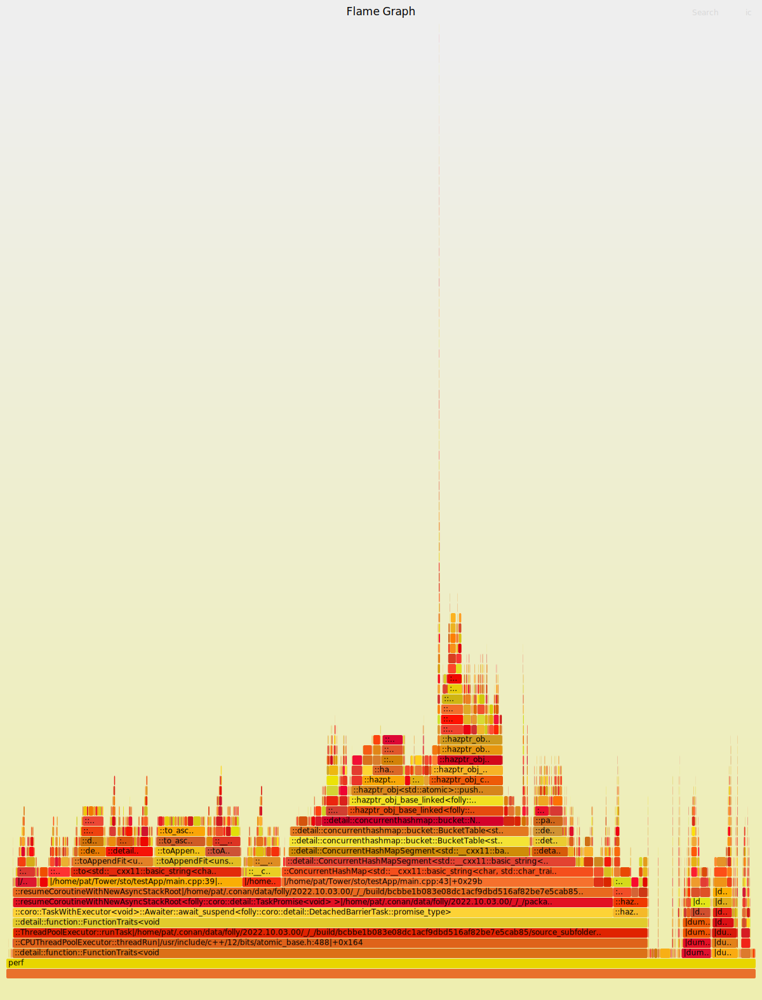

# STO
## store things, optimized

### !!! this is wip and (look at the flamegraphs...) does not really work yet (either due to a bug in output formatting or input parsing)!!!

This repo is a demonstrates a way to store profiler data that we have found to scale well.

It demonstrates a ~500x reduction in data footprint while still retaining the 
information most useful for inspecting systems at scale. We have found this approach to reduce data footprint by about
~8600x. The more data we feed this approach, the more efficient it becomes, so we are not sure when diminishing returns
will kick in.

## bottom line, up front

You should probably read the rest of this doc to generate your own profiler data, but the star of the show is 
the rust crate `sto`. This crate operates on perf script output files (the same that feed into 
[flamegraph](https://github.com/brendangregg/FlameGraph)). It either inputs a perf script output file and outputs a sto
formatted json or (should the --unsto flag be passed) outputs a perf script output format file and inputs a sto formatted
json.

# How to use this repo

First -- look at the following two SVGs:

(./cpu_perf.svg)


(./cpu_perf_unsto.svg)


The first svg was generated from perf script output using flamegraph. The second was generated from "rehydrated"
sto output, also using flamegraph. The decompressed sto data is 4.5mb, the decompressed perf script data is 
2.4GB. 

# How to use this repo (really)

This is a bit involved.

You need to have a linux machine with [at least]((https://github.com/flamegraph-rs/flamegraph/issues/74)) [kernel 5.16](https://michcioperz.com/post/slow-perf-script/) to avoid
perf script taking forever to generate data. Once you have that, depending on the distro, you will have do download
your kernel sources (per that link above) and compile your own perf. The reason for this is to have a perf that is
linked to and uses libbfd to obtain the information addr2line provides without having to repeatedly shell out to 
addr2line.

Having that system, you will then need to install the dependencies of testApp. I like for my test applications to
have a touch of real world to them, so I try and use either dependencies I do use or dependencies in the same
ballpark wrt/ complexity, size and overhead.

testApp uses the conan package manager. You can install conan via pip.

One dependency I wished to use (folly) would not compile on my system with conan (due to a dependency matrix).
Making folly available required I mess with the conan package definition of folly a bit.

To install folly (unless a recent (i.e. compatible with glog 0.6.0) version "just works"), clone
https://github.com/likewhatevs/conan-center-index . In your clone of this repo, from 
`conan-center-index/recipes/folly/all`, run the command `conan export .`. This will export the patched folly
package config to your local conan package repository (i.e. like a local maven install).

Once this has been installed, you can then install testApp via the following commands:
```
cd testApp
mkdir cmake-build-debug
cd cmake-build-debug
conan install .. --build
cmake ..
cmake --build .
```

I personally used the following flags (probably only fPIC and fPIE were necessary):
```
CXXFLAGS=-fno-omit-frame-pointer -mno-omit-leaf-frame-pointer -g -mtune=native -march=native -fPIC -fPIE
LDFLAGS=-flto -fuse-ld=mold
MAKEFLAGS=-j64
CFLAGS=-fno-omit-frame-pointer -mno-omit-leaf-frame-pointer -g -mtune=native -march=native -fPIC -fPIE
```

Having testApp installed, you can generate perf data like cpu_perf.txt via the following command:
```
sudo perf record  --kcore  -e cycles:uk -a -g  -F 997 ./burn -iterations 1000000 -threads 40 -mem_intensive -use_chm
```

This will have testApp generate a bunch of random strings and stick them into a folly concurrent hashmap via
coroutines.

After that command completes, you can then obtain a cpu_perf.txt file similar to the one here via the following command:
```
sudo perf script --full-source-path -F+srcline -k /boot/vmlinuz --kallsyms=/proc/kallsyms > cpu_perf.txt
```

Note -- you will probably get warnings errors wrt/ [kallsyms](https://askubuntu.com/questions/307221/how-to-get-the-address-with-proc-kallsyms) and vmlinuz. If you resolve these (which I did not),
you will probably get nicer output for kernel parts of the profile. I might change my desktop to use gentoo to play 
around with this, tbh.

I have *little* idea if this improved the quality of my data, but I ran it anyhow while waiting for addr2line:
```
apt list --installed | cut -f 1 -d '/' | xargs -I {}  sudo apt install '{}-dbgsym'
```

This bad-idea command will install the debug symbol packages for all those packages it is available 
for on your system (should you be using ubuntu) and it may have made some of my traces be better quality (idk).
You can read more about denug symbol packages [here](https://wiki.ubuntu.com/Debug%20Symbol%20Packages).


# notes
 sudo perf script --full-source-path -F-comm,-tid,-time,-pid,-addr,-dso,-symoff,+srcline,-cpu,-symoff   -k /boot/vmlinuz-5.15.80-gentoo  --kallsyms=/proc/kallsyms > cpu_perf.txt
 sudo perf record  --kcore --call-graph fp  -e cycles:uk -a -g  -F 997 ./burn -iterations 100000 -threads 40 -mem_intensive -use_chm


